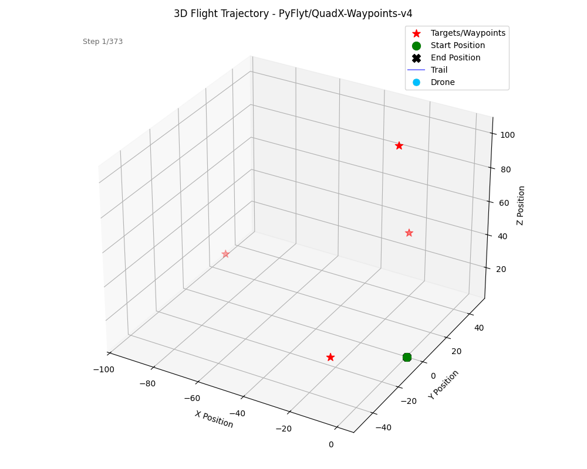

# INFO8003 — Reinforcement Learning Project

UAV control via deep reinforcement learning using PyFlyt.

Authors: `Yanis Geurts` and `Arthur de Landsheere`

All experiments were tracked using **Weight & Biases**. The project is publicly available at https://wandb.ai/ChelseaCity/RL-Drone-Project.

Below is an example of a trajectory we obtain for our best model on the Waypoints environment.
<figure>
  
   <figcaption style="text-align: center;">Best PPO model on flight mode 0. Dome of 150m radius, 4 waypoints.</figcaption>
</figure>
</figure>

All details can either be found in the [scripts](/scripts/) folder, or in the report (see [docs](/docs/) folder). See the [models](/models/) folder for details about the provided checkpoints and their evaluation.

## Repository structure

```bash
Info8003-Project
├── jobs # Different scripts used for curriculum training
│   ├── curA.sbatch
│   ├── curB.sbatch
│   ├── curC.sbatch
│   ├── cur.sbatch
│   ├── eval.sh
│   ├── job.sh
│   └── eval.sbatch
├── models # Best model checkpoints for every environment
│   ├── dogfight
│   ├── hover
│   ├── waypoint
│   └── README.md
├── project_statement
│   ├── main.tex
│   └── project_statement_rl.pdf
├── scripts # Training scripts and wrappers
│   ├── dogfight_wrapper.py
│   ├── env_config.py
│   ├── evaluate_episode.py
│   ├── evaluate_norm.py
│   ├── evaluate_opponents.py
│   ├── evaluate.py
│   ├── opponent_agents.py
│   ├── simulate.py
│   ├── submission_template.py
│   ├── tournament.py
│   ├── train_dogfight.py
│   ├── train_hover.py
│   ├── train_waypoint_phase.py
│   ├── train_waypoint.py
│   ├── tune_params.py
│   └── wrappers.py
├── README.md
├── traj.gif
└── requirements.txt
```

## Setup

```bash
pip install -r requirements.txt
```

## Provided scripts

| Script | Purpose |
|--------|---------|
| `scripts/env_config.py` | Environment parameters (waypoint overrides) |
| `scripts/wrappers.py` | `FlattenWaypointEnv` — flattens dict observations |
| `scripts/dogfight_wrapper.py` | `DogfightSelfPlayEnv` — multi-agent → single-agent wrapper |
| `scripts/evaluate.py` | Evaluate a trained model on Hover or Waypoints |
| `scripts/tournament.py` | Elo-rated dogfight tournament |
| `scripts/submission_template.py` | Tournament submission template |

## Added scripts

| Script | Purpose |
|--------|---------|
| `scripts/evaluate_episode.py` | Runs a single episode and plots step-by-step reward, distance to target, and actions for visual debugging |
| `scripts/evaluate_norm.py` | Variant of `evaluate.py` with `VecNormalize` support for models trained with observation normalization |
| `scripts/evaluate_opponents.py` | Evaluates a trained dogfight agent against the handcrafted opponent pool defined in `opponent_agents.py` |
| `scripts/opponent_agents.py` | Ten handcrafted dogfight opponents of increasing difficulty (random, passive, straight, evasive, aggressive, circling, defensive, altitude-seeking, nose-on) |
| `scripts/simulate.py` | Runs a trained waypoint agent in the PyBullet GUI with a live visual marker tracking the drone position |
| `scripts/train_dogfight.py` | Self-play training loop for the dogfight task (PPO or SAC), with periodic opponent snapshots and W&B logging |
| `scripts/train_hover.py` | Training script for the hover task (PPO or SAC) across flight modes, with W&B logging |
| `scripts/train_waypoint_phase.py` | Curriculum training script for the waypoints task, supporting multi-phase warm-starting from a previous checkpoint |
| `scripts/tune_params.py` | Optuna-based hyperparameter search for PPO and SAC on the waypoints task, with W&B logging per trial |

## Evaluation

```bash
# Evaluate a model on hover
python scripts/evaluate.py --model your_model.py --env hover

# Evaluate a model on waypoints
python scripts/evaluate.py --model your_model.py --env waypoints --flight_mode 6

# Run a dogfight tournament
python scripts/tournament.py submissions/
```

## Tournament submission

Copy `scripts/submission_template.py` to `groupXX_name.py` and implement `load_model()`.
Your model must expose: `model.predict(obs, deterministic=True) -> (action, info)`.

See the project statement for full details.